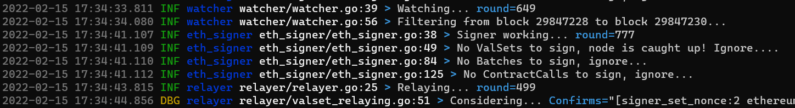

# rzerolog
A logger easier to be used that wrapped with zerolog.




### How to use

#### Global logger

Global logger is created with default configuration. 
We can also create a custom one to replace the global 
logger with invoking `log.SetGlobalLogger(logger *rzerolog.RZeroLogger)` function.

```go
// add import
import "github.com/sophon-labs/rzerolog/log"

func main() {
    // ...
    
    // use global logger
    log.Info().Msg("Hello world!")
    log.Debug().Str("key", "value").Msg("Message")
    err := errors.New("simple error")
    log.Error().Err(err).Msgf("%s", "Message")
    
    // custom global logger
    newLogger := rzerolog.NewRZeroLogger(
        // set level
        WithLevel(rzerolog.InfoLevel),
        // set label name, usually used to mark modules
        WithLabel("label name"),
        )
    log.SetGlobalLogger(newLogger)
    
    // get global logger
    globalLogger := log.GlobalLogger()
    
    // ...
}

```

More examples: See [log_example_test.go](log/log_example_test.go)

#### Create a new logger with default configuration

```go
// new default logger
logger := rzerolog.NewDefaultRZeroLogger()
```

#### Create a new logger with level

```go
// new logger
logger := rzerolog.NewRZeroLogger(WithLevel(rzerolog.InfoLevel))
```

#### Create a new logger with label(eg:module or service name)

```go
// new logger
logger := rzerolog.NewRZeroLogger(WithLabel("label name"))
```

#### Sub logger with label(eg:module or service name)

```go
// root logger
logger := rzerolog.NewRZeroLogger(WithLevel(rzerolog.InfoLevel))
subLogger := logger.GetLabeledSubLogger("label name")
subLogger.Info().Msg("Hello world!")
```

#### More examples 
See [logger_example_test.go](logger_example_test.go)

### Developer
[Ramboll](https://github.com/ramboll-max)

[Sophon-labs](https://github.com/sophon-labs)
